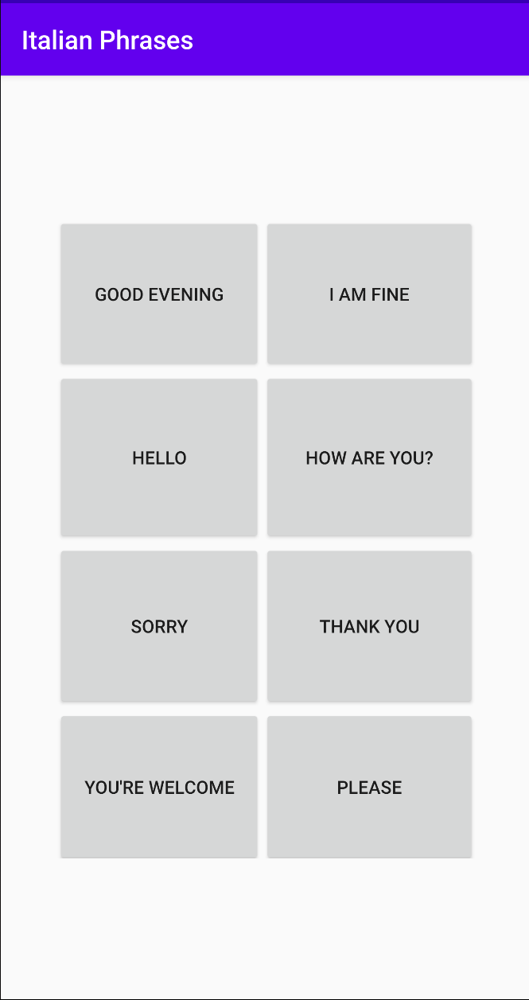

# Italian-Phrases
An Android application that speaks out loud several common English phrases in Italian.

# Phrases:
1. Good Evening!
2. I am fine.
3. Hello!
4. How are you?
5. Sorry.
6. Thank you!
7. You're welcome.
8. Please.

# Application Landing Page
The user just has to tap on any phrase button and then it will be spoken out in Italian.

